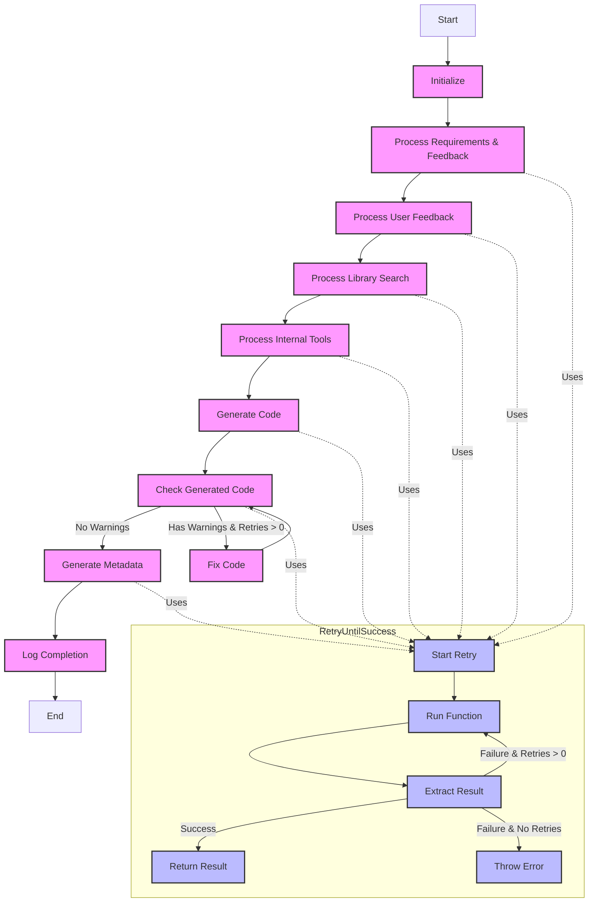

# Shinkai Prompt Testing

This repository contains a collection of projects for testing and developing the Shinkai prompt system, which is designed to generate code and tools using AI.

## Projects Overview

### 1. Shinkai API (`projects/shinkai-api/`)

The core API service that handles the main Shinkai functionality. This service processes prompts, generates code, and manages the overall workflow.

### 2. Code Generation API (`projects/code-generation-api/`)

A specialized API service focused on code generation tasks. It provides endpoints for generating code based on various requirements and specifications.

### 3. Code Generation (`projects/code-generation/`)

A standalone project that demonstrates and tests code generation capabilities. It includes examples and test cases for different code generation scenarios.

### 4. Shinkai Tool Generator (`projects/shinkai-tool-generator/`)

A utility project for generating Shinkai-compatible tools. It helps create new tools that can be integrated into the Shinkai ecosystem.

## Setup and Installation

1. Clone the repository:

```bash
git clone git@github.com:dcSpark/shinkai-prompt-test.git
cd shinkai-prompt-test
```

2. Set up environment variables:

```bash
cp .env.example .env
```

Edit the `.env` file to add your API keys and other configuration:

- `BRAVE_API_KEY`: Your Brave API key
- Other required keys as specified in the `.env.example` file

## Running the Projects

### Code Generation Api

To run the main service:

```bash
deno task start:code-generation-api
```

### Code Generation (run the lib throught a test)

```bash
deno task start:code-generation
```

### Other commands

```bash
deno task -r check
deno task -r lint
deno task -r test
```

## Testing projects manually

Having code-generation-api running:

Call endpoints directly using curl

```bash
curl localhost:8080/generate?language=typescript&prompt=hello_world
```

Use the testing website (shinkai-tool-generator)

```bash
cd projects/shinkai-tool-generator
npm ci
npm run dev
```

## Pipeline Flow

The system follows a structured pipeline flow as shown in the diagram below:



The pipeline includes several key components:

- **Main Pipeline Flow**: Sequential processing from initialization to completion
- **RetryUntilSuccess**: Self-looping retry mechanism (up to 3 attempts) for robust execution
- **Warning Handling**: Code fix loop for handling detected warnings
- **Integration Points**: Retry mechanism utilization throughout the main flow
- Integration Points: Dotted lines show where the retry mechanism is utilized in the main flow
